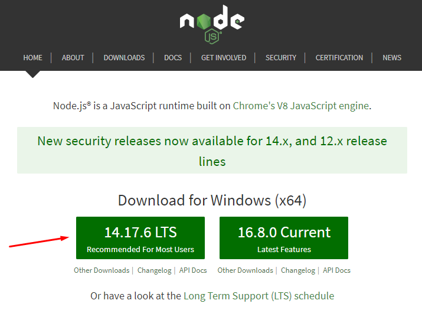
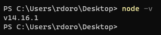

# Guia: Instalação do NODE e do YARN
## Node
### Windows
> Link para download do NODE: https://nodejs.org/en/


- Baixe e instale a versão LTS do link acima (versão recomendada/mais estável).
    

- Após a instalação, verifique se o Node foi instalado corretamente através do terminal
    ```bash
    node -v
    ```

- O terminal deverá exibir a versão do Node que foi instalada, como mostrado no exemplo abaixo


### Linux 
- Utilize o terminal para a instalação do Node
    ```bash
    sudo apt install nodejs
    ```

- Após a instalação, verifique se o Node foi instalado corretamente através do terminal
    ```bash
    node -v
    ```

## Yarn
- Instale o YARN utilizando o próprio NODE, inserindo no terminal:
    ```bash
    npm install --global yarn
    ```
